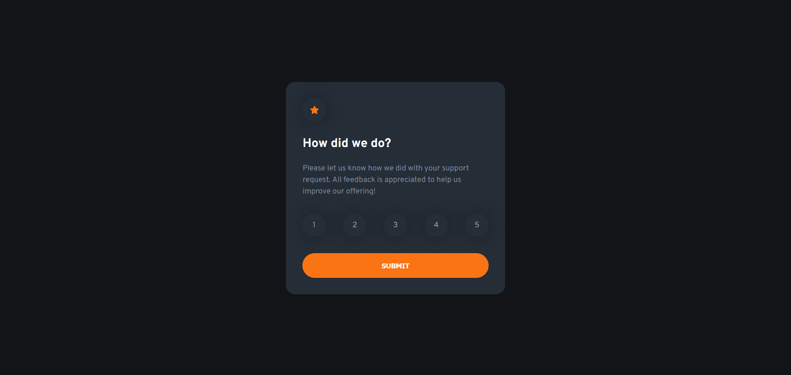
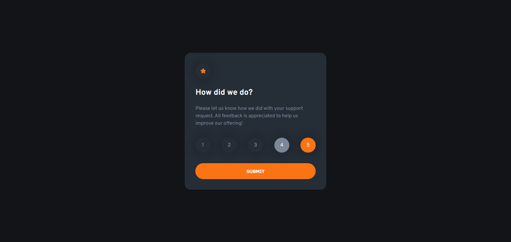
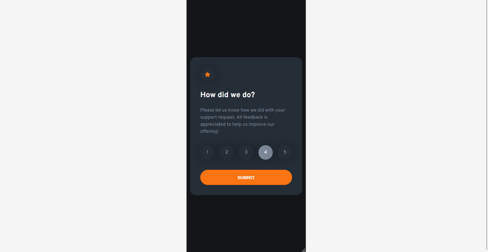
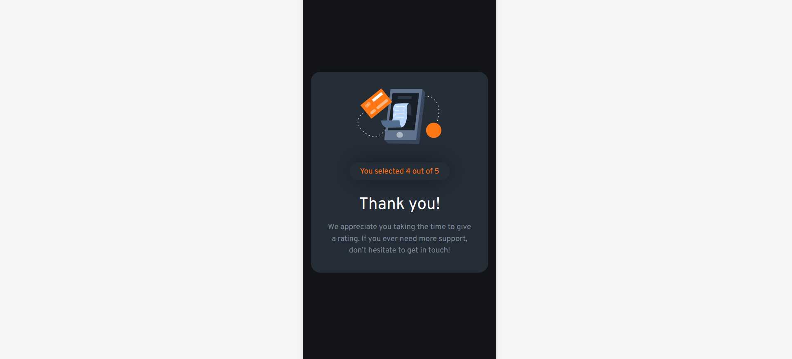

# Frontend Mentor - Interactive rating component solution

This is a solution to the [Interactive rating component challenge on Frontend Mentor](https://www.frontendmentor.io/challenges/interactive-rating-component-koxpeBUmI). Frontend Mentor challenges help you improve your coding skills by building realistic projects. 

## Table of contents

- [Overview](#overview)
  - [Screenshot](#screenshot)
  - [Links](#links)
- [My process](#my-process)
  - [Built with](#built-with)
- [Author](#author)

## Overview

### Screenshot
**Desktop Preview**

**Active Preview**

**Desktop Result Preview**

**Mobile Preview**

**Mobile Result Preview**

### Links

- Solution URL: [Github Repo URL](https://github.com/Harry-Crocksick/interactive_rating_component)
- Live Site URL: [Deployed site URL](https://marn-rating-component.netlify.app/)

## My process
Made with HTML, CSS and Vanilla JS

### Built with

- Semantic HTML5 markup
- Vanilla JS
- Flexbox
- Grid
- CSS custom properties
- Mobile-first workflow

## Author

- Social Media - [Marn Tet Zan](https://www.facebook.com/james.christian.3914207)
- Frontend Mentor - [@Harry-Crocksick](https://www.frontendmentor.io/profile/Harry-Crocksick)

